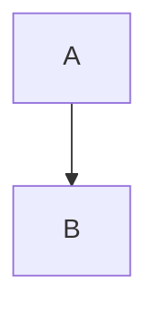

# Release plan for **v2**

Intro paragraph with *emphasis*, **strong**, ***both***, `code`, a [link](https://example.com "T"), an
autolink <https://example.org>, a bare URL https://example.net/x?y=1, and ~~struck~~ text.  
Hard break above. Escaped \*stars\* and an &amp; entity & a raw ampersand. Snake_case_word stays.

## Lists

- one
- two
  - nested a
  - nested b
- three

1. first
2. second

3. third (loose)

- [ ] todo item
- [x] done item

## Table

| Name | Count | Note |
|:-----|------:|:----:|
| a    | 1     | `x|y` |
| b \| c | 22 | |

## Code

```python
def f(x):
    return x < 3 and "q"
```



> A quote
continued lazily
> > nested

    indented code

Setext heading
--------------

<div class="note">raw <b>html</b> block</div>


[ref link][r1] and [r1].

[r1]: https://ref.example "Ref Title"

***
Final line.
